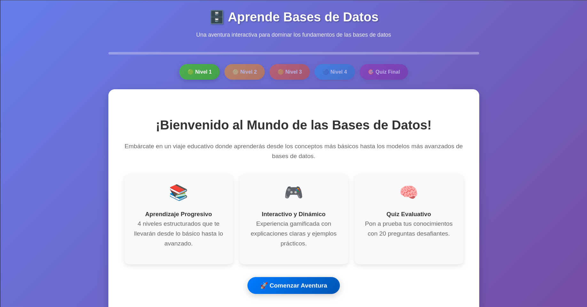
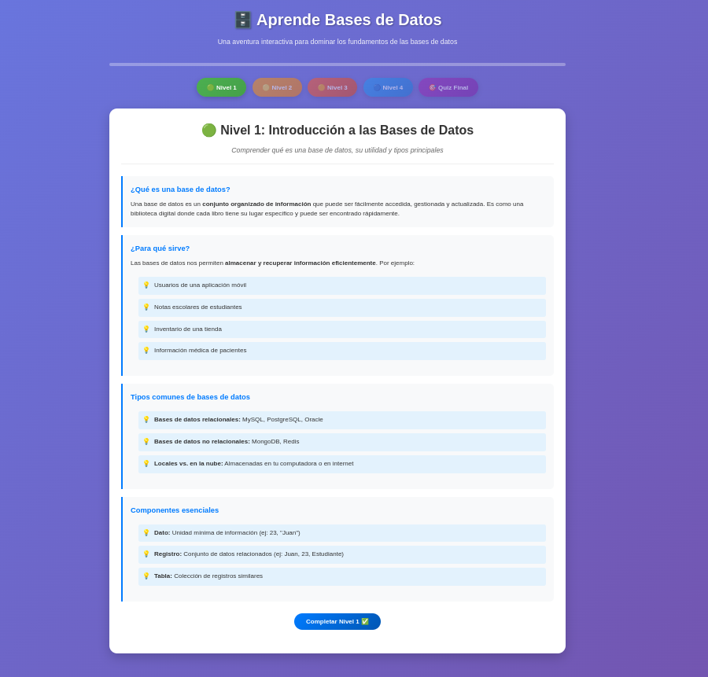
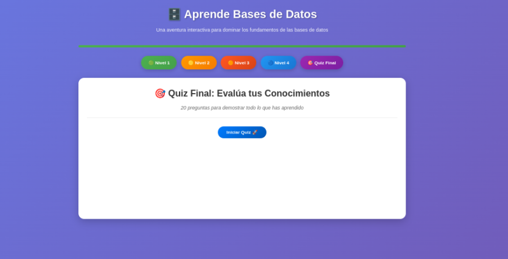
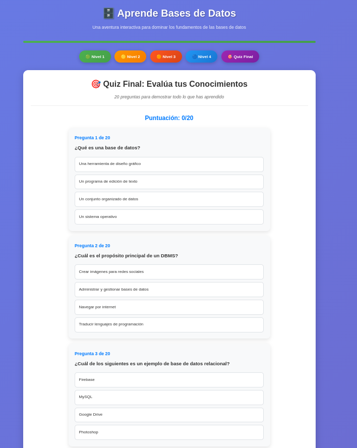
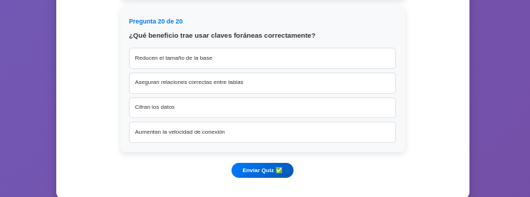
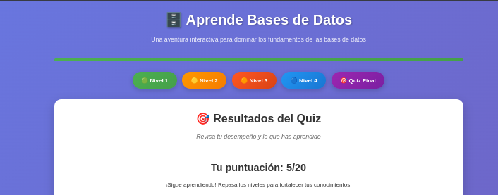

# Taller Base de Datos – Aplicación Web Interactiva con Cuestionario

**Estudiantes:**
- JUAN SEBASTIAN GUALDRON GALLO – SCRUM MASTER
- KEVIN SANTIAGO RIVERO RUEDA – PRODUCT OWNER
- CONNIE TATIANA CARRILLO BOHORQUEZ – DESARROLLADOR
- JUAN CAMILO ROJAS ARENAS – DESARROLLADOR
- CRISTIAN MIGUEL PEREZ HERNANDEZ – DESARROLLADOR

**Docente:** Juan Carlos Mariño Morates  
**Lugar:** Campuslands – Salón Artemis – Ruta NodeJS – Floridablanca  
**Año:** 2025  

---

## Situación Problema

La cuestión que estamos enfrentando es la escasez de educación sobre las bases de datos y la complejidad que enfrentan los estudiantes para asimilar esta teoría, dado que no existen materiales interactivos y pedagógicos adecuados para la instrucción de esta temática.

---

## Objetivo

**Crear una aplicación web interactiva con cuestionario** que promueva la comprensión de bases de datos a través de herramientas visuales, dinámicas y accesibles para estudiantes sin experiencia previa.

---

## Requerimientos Funcionales

A continuación, se presentan los requerimientos funcionales con sus historias de usuario:

### RF01 – Selección de nivel
**Actor:** Estudiante  
**Descripción:** Como estudiante, quiero poder seleccionar entre diferentes niveles de dificultad o temática, para avanzar según mi ritmo y conocimiento previo sobre bases de datos.  
**Funcionalidad:** El sistema mostrará una lista de niveles temáticos.  
**Criterios de aceptación:**
- Mostrar niveles disponibles.
- Permitir seleccionar solo niveles desbloqueados.
- Cargar el contenido asociado correctamente.
**Restricciones:**
- No acceder a niveles superiores sin completar los anteriores.
- Niveles organizados lógicamente.

---

### RF02 – Navegación en la plataforma
**Actor:** Estudiante  
**Descripción:** Como estudiante, quiero desplazarme por las diferentes pantallas y secciones de la aplicación, para explorar el entorno educativo de manera sencilla e intuitiva.  
**Funcionalidad:** Navegación mediante botones o menús identificados.  
**Criterios de aceptación:**
- Cambio de sección sin recargar toda la página.
- Botones visibles y comprensibles.
- Tiempo de respuesta < 2 segundos.
**Restricciones:**
- Compatible con teclado y táctil.
- No navegar a secciones no habilitadas.

---

### RF03 – Desbloqueo progresivo
**Actor:** Estudiante  
**Descripción:** Como estudiante, quiero que los módulos estén inicialmente bloqueados y se desbloqueen al completar los anteriores, para tener una progresión guiada.  
**Funcionalidad:** Los módulos se desbloquean al completar los previos.  
**Criterios de aceptación:**
- Mostrar módulos bloqueados.
- Desbloquear siguiente módulo al completar el anterior.
- Solo acceder a módulos desbloqueados.
**Restricciones:**
- No alterar manualmente el orden de desbloqueo.
- Guardar datos de desbloqueo en el perfil del usuario.

---

### RF04 – Mini retos educativos
**Actor:** Estudiante  
**Descripción:** Como estudiante, quiero resolver mini cuestionarios o pruebas, para aplicar mis conocimientos sobre bases de datos y continuar avanzando.  
**Funcionalidad:** Cuestionarios interactivos con preguntas de opción múltiple o ejercicios prácticos.  
**Criterios de aceptación:**
- Presentar cuestionarios en momentos clave.
- Validar respuestas y mostrar resultados.
- Permitir repetir el cuestionario si no se aprueba.
**Restricciones:**
- Cuestionarios alineados con el módulo actual.
- No avanzar sin completar el cuestionario.

---

### RF05 – Visualización de base de datos
**Actor:** Estudiante  
**Descripción:** Como estudiante, quiero visualizar gráficamente la estructura de una base de datos, para comprender cómo se organizan los datos.  
**Funcionalidad:** Mostrar tablas, columnas y relaciones de forma gráfica.  
**Criterios de aceptación:**
- Mostrar tablas y relaciones claramente.
- Permitir acercar/alejar la vista.
- Actualizar visualización ante cambios.
**Restricciones:**
- Visualización solo de lectura.
- Debe ser responsiva.

---

### RF06 – Interacción con elementos
**Actor:** Estudiante  
**Descripción:** Como estudiante, quiero interactuar con elementos de la aplicación, para recibir explicaciones o retos relacionados con teoría de bases de datos.  
**Funcionalidad:** Mostrar información educativa al interactuar con elementos definidos.  
**Criterios de aceptación:**
- Mostrar información relevante al interactuar.
- Interacción sencilla e intuitiva.
- Información clara y contextual.
**Restricciones:**
- Solo interactuar con elementos habilitados.
- Textos breves y comprensibles.

---

### RF07 – Sistema de puntuación
**Actor:** Estudiante  
**Descripción:** Como estudiante, quiero obtener puntos o estrellas según mi rendimiento, para motivarme a mejorar y avanzar.  
**Funcionalidad:** Asignar puntos al completar correctamente cuestionarios.  
**Criterios de aceptación:**
- Registrar puntos por cada cuestionario aprobado.
- Mostrar puntaje al finalizar cada módulo.
- Guardar puntaje para futuras sesiones.
**Restricciones:**
- No asignar puntos si el cuestionario no se aprueba.
- Evitar duplicar puntos por un mismo cuestionario.

---

### RF08 – Guardado de progreso
**Actor:** Estudiante  
**Descripción:** Como estudiante, quiero que mi progreso se guarde automáticamente o manualmente, para continuar desde el mismo punto después.  
**Funcionalidad:** Guardado automático al finalizar un módulo y manual desde un botón.  
**Criterios de aceptación:**
- Guardar automáticamente al terminar un módulo.
- Permitir guardar en cualquier momento.
- Cargar progreso correctamente al volver.
**Restricciones:**
- Requiere conexión activa con la base de datos.
- Guardado sin interrumpir la experiencia.

---

### RF09 – Retroalimentación inmediata
**Actor:** Estudiante  
**Descripción:** Como estudiante, quiero recibir retroalimentación inmediata después de cada desafío, para aprender de mis errores y aciertos.  
**Funcionalidad:** Mostrar mensajes y efectos visuales al responder correctamente o no.  
**Criterios de aceptación:**
- Mostrar mensaje claro tras cada respuesta.
- Indicar si es correcta o no.
- Mostrar retroalimentación de forma rápida.
**Restricciones:**
- No incluir términos técnicos confusos.
- Mostrar en menos de 1 segundo.

---

### RF10 – Panel de progreso
**Actor:** Estudiante  
**Descripción:** Como estudiante, quiero visualizar mi progreso general, nivel alcanzado y puntaje, para tener un seguimiento claro de mi avance.  
**Funcionalidad:** Mostrar panel con información resumida.  
**Criterios de aceptación:**
- Mostrar avance en cada módulo.
- Actualizarse en tiempo real.
- Permitir revisar historial de intentos.
**Restricciones:**
- Solo el usuario puede ver su progreso.
- Panel visible desde cualquier sección.

---

## Requerimientos No Funcionales

### RNF01 – Usabilidad
**Actor:** Estudiante  
**Descripción:** Como estudiante sin conocimientos previos en bases de datos, quiero que la interfaz sea intuitiva y amigable, para comprender rápidamente cómo usar la plataforma sin capacitación adicional.  
**Funcionalidad:** Interfaz clara con iconografía sencilla y menús bien organizados.  
**Criterios de aceptación:**
- Mostrar instrucciones claras.
- Botones y opciones comprensibles.
- Navegación sin necesidad de manual extenso.
**Restricciones:**
- No usar términos técnicos complejos.
- Diseño consistente en todas las secciones.

---

### RNF02 – Accesibilidad
**Actor:** Estudiante  
**Descripción:** Como estudiante, quiero usar la plataforma desde mi navegador sin instalar programas, para acceder fácilmente desde cualquier lugar.  
**Funcionalidad:** Ejecutable en navegadores modernos sin complementos.  
**Criterios de aceptación:**
- Carga correcta en navegadores principales.
- No solicitar instalación de software adicional.
- Accesible mediante URL.
**Restricciones:**
- Cumplir estándares web actuales.
- No depender de tecnologías obsoletas.

---

### RNF03 – Portabilidad
**Actor:** Estudiante  
**Descripción:** Como estudiante, quiero acceder a la plataforma desde distintos sistemas operativos, para no estar limitado por mi dispositivo.  
**Funcionalidad:** Compatibilidad con Windows, Linux y MacOS.  
**Criterios de aceptación:**
- Funcionalidad idéntica en todos los sistemas.
- Sin errores específicos por sistema operativo.
**Restricciones:**
- Evitar componentes exclusivos.
- Realizar pruebas en los tres sistemas principales.

---

### RNF04 – Rendimiento
**Actor:** Estudiante  
**Descripción:** Como estudiante, quiero que la aplicación cargue rápidamente, para no perder tiempo y mantenerme motivado.  
**Funcionalidad:** Optimizar recursos y tiempos de carga.  
**Criterios de aceptación:**
- Tiempo de carga inicial < 5 segundos.
- Imágenes y recursos optimizados.
- Sin pausas ni retrasos notorios.
**Restricciones:**
- No usar archivos pesados innecesarios.
- Mantener rendimiento estable en sesiones largas.

---

### RNF05 – Escalabilidad
**Actor:** Administrador  
**Descripción:** Como administrador, quiero que la arquitectura permita agregar nuevos módulos o funcionalidades, para ampliar el contenido sin rehacer el sistema.  
**Funcionalidad:** Diseño modular y adaptable.  
**Criterios de aceptación:**
- Agregar módulos sin afectar los existentes.
- Nuevos temas sin cambios drásticos.
- Rendimiento estable tras ampliación.
**Restricciones:**
- Seguir principios de modularidad.
- No generar conflictos entre módulos.

---

### RNF06 – Mantenimiento
**Actor:** Desarrollador  
**Descripción:** Como desarrollador, quiero que el código esté documentado, para realizar mantenimiento y actualizaciones sin dificultades.  
**Funcionalidad:** Comentarios claros, documentación técnica y convenciones estandarizadas.  
**Criterios de aceptación:**
- Cada módulo con comentarios descriptivos.
- Guía técnica o README actualizado.
- Nombres de variables y funciones coherentes.
**Restricciones:**
- No usar comentarios confusos.
- Mantener documentación al día.

---

### RNF07 – Interactividad
**Actor:** Estudiante  
**Descripción:** Como estudiante, quiero que la experiencia incluya animaciones suaves y elementos dinámicos, para mantenerme interesado mientras aprendo.  
**Funcionalidad:** Efectos visuales y transiciones suaves sin afectar el rendimiento.  
**Criterios de aceptación:**
- Animaciones fluidas.
- Elementos dinámicos resaltando información importante.
- Sin interferir con la lectura.
**Restricciones:**
- No usar animaciones excesivas.
- Sonidos opcionales.

---

### RNF10 – Retroalimentación visual
**Actor:** Estudiante  
**Descripción:** Como estudiante, quiero que el sistema muestre reacciones visuales inmediatas al completar tareas o cometer errores, para sentir motivación y aprender de manera dinámica.  
**Funcionalidad:** Cambios visuales (colores, íconos, animaciones) al completar retos o fallar.  
**Criterios de aceptación:**
- Mostrar efectos positivos al completar tareas.
- Mostrar señales visuales al cometer errores.
- Reacciones claras y consistentes.
**Restricciones:**
- No usar efectos que dificulten la lectura.
- Reacciones breves y no intrusivas.

---

## Conclusiones
- La construcción de la aplicación web interactiva con cuestionario permitió diseñar un entorno educativo innovador, fácil de usar y adaptado a estudiantes sin conocimientos previos de bases de datos.

- La estructura modular y el desbloqueo progresivo de módulos aseguraron un aprendizaje escalonado y más efectivo.

- La incorporación de elementos dinámicos, retroalimentación inmediata y panel de progreso aumentó el interés y la motivación de los usuarios.

- La metodología ágil utilizada facilitó la comunicación constante y la entrega continua de funcionalidades, mejorando la calidad y el cumplimiento de los objetivos del proyecto.

- El trabajo colaborativo y la documentación constante permiten que el proyecto pueda ampliarse y mantenerse a futuro de forma sencilla.

---

## Metodología:
- Para el desarrollo del proyecto se adoptó la metodología ágil Scrum, la cual permitió una organización eficiente del trabajo mediante iteraciones y entregas incrementales.

**El equipo se dividió en roles claros:**

> Product Owner: Encargado de priorizar los requerimientos y asegurar que el producto cumpla con las necesidades educativas.

> Scrum Master: Responsable de facilitar las ceremonias, resolver impedimentos y asegurar el cumplimiento de la metodología.

> Equipo de desarrollo: Encargado de implementar los requerimientos funcionales y no funcionales, realizando pruebas continuas y documentando el código.

- Las actividades se gestionaron en sprints semanales, realizando las siguientes ceremonias:

> Sprint Planning: Definición de tareas y alcance semanal.

> Daily Stand Up: Revisión diaria de avances e impedimentos.

> Sprint Review: Presentación de funcionalidades completadas.

> Sprint Retrospective: Análisis de lo que se puede mejorar para el siguiente sprint.

Se utilizó un tablero Scrum digital para gestionar tareas, priorizar historias de usuario y hacer seguimiento de responsabilidades y tiempos. El trabajo colaborativo se respaldó mediante un repositorio con ramas controladas y convencional commits para mantener la calidad del código.

---

## Evidencia de planteamiento de plataforma de trabajo
- **Repositorio:** (https://github.com/cristian20252025/Taller-Bases-De-Datos)  
- **Videos de reuniones:** (agregar links de sprint planning, daily stand up, retrospectiva).  
- **Tablero Scrum:** (https://app.clickup.com/90131037410/v/o/s/90138380514)  
- **Documentación:** Tecnologías usadas y cumplimiento de tareas planteadas.

---

## Conclusiones
- Conclusiones generales del documento.  
- Conclusiones de la reunión de retrospectiva del sprint.

---

> **Nota:**  
> Este README resume el contenido del documento original en un formato estándar para proyectos de software, permitiendo integrarlo directamente en tu repositorio GitHub o similar.

